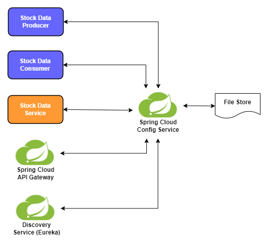

# TABLE OF CONTENTS

1. <a href="#1-Project-Overview" id="1">Project Overview</a>
2. <a href="#2-Getting-Started" id="2">Getting Started</a>
3. <a href="#3-Whats-Next" id="3">What’s Next</a>

# 1. Project Overview

This application demonstrates the integration of Apache Kafka, Keycloak, and the Elastic Stack (
Elasticsearch, Logstash, and Kibana) with Spring Cloud. It continuously retrieves market data from
an external source and processes it through a microservices architecture. This architecture not only
handles and secures data effectively but also uses the Elastic Stack to centralize logging across
all microservices, enhancing system capabilities and operational transparency.

**<ins>Application Architecture Overview</ins>**

**<ins>Centralized Configuration Management Overview</ins>**

**<ins>Log Management Overview with the Elastic Stack</ins>**

- **Stock Quote Producer:** This service retrieves market data via an external API and publishes it
  to a Kafka message queue.

- **Stock Quote Consumer:** This service listens to the Kafka message queue. Upon receiving data, it
  processes and forwards the information to the Stock Data Service via the Spring Cloud Gateway.

- **Stock Data Service:** Provides CRUD operations for database management. This service is secured
  with
  Keycloak, ensuring that all interactions are authenticated and authorized.

- **Gateway Service:** This service acts as a central point for routing traffic to the appropriate
  microservices within the architecture. It simplifies the network design and provides a single
  entry
  point to manage incoming requests.

- **Discovery Service:** Utilizes "Spring Cloud Netflix Eureka" to function as a service registry.
  This
  component helps in maintaining an up-to-date list of services available, enabling dynamic
  discovery
  across microservices.

- **Config Service:** Manages and stores configurations for all microservices in a centralized
  manner.
  This ensures that all components have a consistent configuration state and can be easily managed
  and
  updated.

- **Keycloak:** Serves as the authentication server that secures microservices by managing and
  storing
  user credentials and roles. It ensures that only authorized users can access the services, using
  OpenID Connect.

- **PostgreSQL:** Utilized as the relational database management system providing two schemas
  setups. One schema is dedicated to storing Keycloak's security and user management data, while the
  other manages market data processed by the application.

- **Kafka:** Functions as the central messaging queue that facilitates communication between the
  Stock
  Quote Producer and Stock Quote Consumer. The Kafka ecosystem in this project includes a Schema
  Registry for managing message schemas, Zookeeper for cluster coordination, and a Kafka Broker for
  handling message storage and retrieval.

- **Elasticsearch (es01):** Acts as a highly scalable search and analytics engine. It stores,
  searches, and analyzes big volumes of data quickly and in near real-time, making it a foundational
  component in the Elastic Stack.

- **Logstash:** Serves as a data processing pipeline that ingests data from multiple sources
  simultaneously, transforms it into JSON format, and then forwards it to Elasticsearch.

- **Kibana:** Provides powerful visualizations for data stored in Elasticsearch.

# 2. Getting Started

## 2.1  Pre-requisites

Before you begin, ensure you have the following software installed on your system:

- **Docker:** Used for hosting and managing application containers.
- **Maven:** Required for building the project.
- **Java JDK 17 or higher:** Necessary to run the Spring Boot applications.
- **Postman:** Recommended for testing and interacting with the application through its API
  endpoints.

## 2.2  Configure the Application

- This application retrieves market data from [Twelve Data](https://twelvedata.com/). To access this
  data, you must first register for an account at the [Twelve Data](https://twelvedata.com/) website
  and obtain an API key. Once you have your API key, replace the existing key in the file
  of `config-service/src/main/resources/api-key.yml` with your new key.

- By default, the application retrieves stock data for AAPL, NVDA and TSLA
  from [Twelve Data](https://twelvedata.com/) for every minute. To customize this setting, edit
  the `twelve-config` section in the`config-service/src/main/resources/stock-quote-producer.yml`
  file.

## 2.3  Build the Application

- Go to the root folder
- Run `mvn install -Pbuild-image` to build the images
- Run `docker image ls` to list the images for verification
  | Name | Description |
  | :------------------------------- | :------------------- |
  | org.finance/gateway-service | Gateway Service |
  | org.finance/stock-quote-consumer | Stock Quote Consumer |
  | org.finance/config-service | Config Service |
  | org.finance/discovery-service | Discovery Service |
  | org.finance/stock-data-service | Stock Data Service |
  | org.finance/stock-quote-producer | Stock Quote Producer |

## 2.4  Start the Application

- Run `cd docker-compose` to switch to the "docker-compose" directory.
- Open three separate terminal windows for executing the following commands
    - Run `docker-compose up stock-quote-producer` to launch the stock quote producer along with its
      related dependencies.
    - Run `docker-compose up stock-quote-consumer` to launch the stock quote consumer along with its
      related dependencies.
    - Run `watch docker ps` to continuously monitor all components, ensuring they reach a healthy
      status.
- Please note that starting all modules may take approximately 5 minutes. During this time, monitor
  the output to ensure that all components are initializing correctly and check for any errors.

## 2.5  Test the Application

- Import `postman/Stock-Application-API.postman_collection.json` into Postman, there are six API
  requests as below
    - Get Access Token (Full Control)
    - Get Access Token (Read)
    - Get All Available Stocks
    - Get Stock Details (Symbol / Exchange)
    - Get Stock Details (Id)
    - Save Stock Data

### 2.5.1  Scenario 1 (Unauthorized Request)

- Execute the `Get All Available Stocks` API request.

### 2.5.2  Scenario 2 (Forbidden Request)

- Obtain an access token from Keycloak by running the `Get Access Token (Read)` API request.
- Execute the `Save Stock Data` API request.

### 2.5.3  Scenario 3 (Authorized Request)

- Obtain an access token from Keycloak by running the `Get Access Token (Read)` API request.
- Execute the `Get All Available Stocks` API request.

### 2.5.4  Scenario 4 (Continuous Data Retrieval)

- Obtain an access token from Keycloak by running the `Get Access Token (Read)` API request.
- Execute the `Get Stock Details (Symbol / Exchange)` API request. Ensure to update the parameter as
  necessary based
  on the output from the `Get All Available Stocks` request.
- Wait for 1 minute and repeat the `Get Stock Details (Symbol / Exchange)` request to verify
  continuous data
  fetching.

## 2.6  Database

There are two database schemas in this application

**<u>Keycloak Database</u>** 

- **URL:** jdbc:postgresql://localhost:5432/keycloak_db
- **User:** admin
- **Password:** password

**<u>Market Database</u>** 

- **URL:** jdbc:postgresql://localhost:5432/market_db
- **User:** admin
- **Password:** password

## 2.7  Keycloak

Upon startup, Keycloak will import the `stockapp` realm defined in
the `docker-compose/keycloak/stockapp-realm-export.json` file. This realm includes two
clients: `stockapp-read-api` and `stockapp-full-control-api`, each specifying different permissions
within the application.

**<u>Administration Console</u>** 

- **URL:** http://localhost:7000
- **User:** admin
- **Password:** admin

## 2.8 Kibana

View and analyze logs through Kibana using the administration console.

**<u>Administration Console</u>** 

- **URL:** http://localhost:5601
- **User:** elastic
- **Password:** password
- **Indices for logs:** logstash-*

## 3. What’s Next

- **Document Architecture:** Provide detailed documentation on the project's architecture. This will
  include diagrams and descriptions to help users understand how the components interact and how
  data flows within the system.
- **Transition to KRaft:** With ZooKeeper being marked as deprecated since the 3.5.0 release of
  Apache Kafka, this project will shift to using the KRaft metadata system. This move follows
  recommendations from Apache to adopt their newer approach for metadata management.
- **Implement Frontend:** Develop a user interface to display market data. This frontend will
  consume the backend API to present data dynamically to users.
- **Secure Free Hosting:** Identify and utilize a free hosting solution to make the application
  accessible to a wider audience without any setup required on the user's end.

